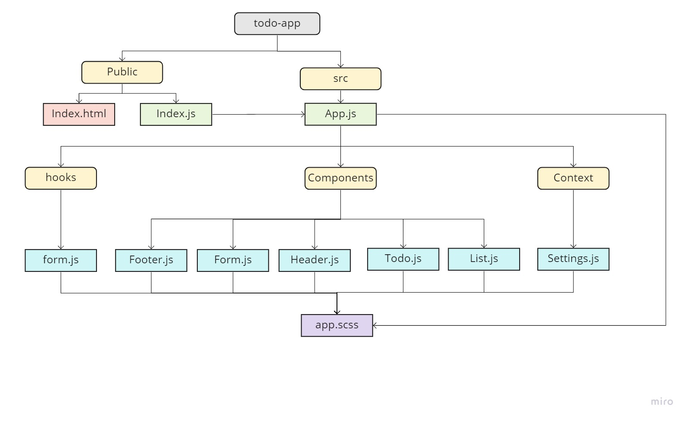

# todo-app

## Author : Sana Ishaqat

## Description :
## Phase 1 Requirements-Lab31

In Phase 1, we’re going to perform some refactoring of the To Do application as built by another team. This application mixes application state and user settings at the top level and passes things around. It was a good proof of concept, but we need to make this production ready.

Style the application using the Blueprint Component API{target:_blank}

Properly modularize the application into separate components

Implement the Context API to make some basic application settings available to components

How many To Do Items to show at once
Whether or not to show completed items
### Links and Resources:

[Branch context-settings](https://github.com/SanaIshaqat/todo-app/context-settings)

[gh-Pages Link LAB-31](https://sanaishaqat.github.io/todo-app/)

[pull request LAB-31](https://github.com/SanaIshaqat/todo-app/pull/1)

UML :
